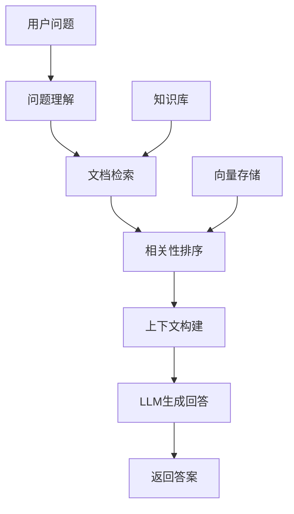

# RAG（检索增强生成）完全指南 🚀

## 📚 目录

- [什么是RAG？](#什么是rag)
- [RAG核心组件](#rag核心组件)
- [环境准备](#环境准备)
- [快速开始](#快速开始)
- [高级RAG技术](#高级rag技术)
- [实践项目](#实践项目)
- [性能优化](#性能优化)
- [常见问题](#常见问题)
- [学习资源](#学习资源)

## 🎯 什么是RAG？

**RAG (Retrieval-Augmented Generation)** 是一种结合检索和生成的AI技术，它能够：

1. **减少幻觉**：基于真实文档内容生成回答
2. **提高准确性**：利用知识库中的权威信息
3. **增强时效性**：可以轻松更新知识库内容
4. **可解释性**：可以追溯回答的信息来源

### RAG工作原理



## 🧩 RAG核心组件

### 1. 文档处理器 (Document Processor)
- **文档分割**：将长文档切分为合适的块
- **元数据提取**：自动提取文档的关键信息
- **预处理**：清理和标准化文档内容

### 2. 向量存储 (Vector Storage)
- **嵌入模型**：将文本转换为向量表示
- **向量数据库**：高效存储和检索向量
- **相似度搜索**：找到最相关的文档片段

### 3. 检索器 (Retriever)
- **基础检索**：简单的相似度搜索
- **多查询检索**：生成多个搜索查询
- **压缩检索**：精简检索到的内容
- **重排序**：优化检索结果的排序

### 4. 生成器 (Generator)
- **提示工程**：设计有效的生成提示
- **上下文管理**：合理利用检索到的信息
- **输出格式化**：生成结构化的回答

## 🔧 环境准备

### 基础依赖
```bash
# 核心LangChain包
pip install langchain langchain-openai langchain-community

# 向量数据库
pip install faiss-cpu chromadb

# 文档处理
pip install pypdf tiktoken

# 可选：GPU支持
pip install faiss-gpu
```

### 完整依赖
```bash
# 安装所有RAG相关依赖
pip install -r requirements.txt
```

### 环境变量配置
```bash
# .env 文件
OPENAI_API_KEY=your_openai_api_key
ANTHROPIC_API_KEY=your_anthropic_api_key

# 本地模型（可选）
HUGGINGFACEHUB_API_TOKEN=your_huggingface_token
```

## 🚀 快速开始

### 第一步：基础RAG系统

```python
from langchain_openai import ChatOpenAI, OpenAIEmbeddings
from langchain.vectorstores import FAISS
from langchain.text_splitter import RecursiveCharacterTextSplitter
from langchain_core.prompts import ChatPromptTemplate
from langchain_core.runnables import RunnablePassthrough
from langchain_core.output_parsers import StrOutputParser

# 1. 初始化模型
llm = ChatOpenAI(model="gpt-3.5-turbo", temperature=0.1)
embeddings = OpenAIEmbeddings()

# 2. 准备文档
documents = [
    "人工智能是计算机科学的一个分支...",
    "机器学习是AI的核心技术...",
    "深度学习使用多层神经网络..."
]

# 3. 分割文档
text_splitter = RecursiveCharacterTextSplitter(
    chunk_size=1000,
    chunk_overlap=200
)
chunks = text_splitter.create_documents(documents)

# 4. 创建向量存储
vector_store = FAISS.from_documents(chunks, embeddings)

# 5. 创建检索器
retriever = vector_store.as_retriever(search_kwargs={"k": 3})

# 6. 构建RAG链
template = """基于以下上下文信息回答问题：
上下文：{context}
问题：{question}
回答："""

prompt = ChatPromptTemplate.from_template(template)

rag_chain = (
    {"context": retriever, "question": RunnablePassthrough()}
    | prompt
    | llm
    | StrOutputParser()
)

# 7. 使用RAG系统
question = "什么是人工智能？"
answer = rag_chain.invoke(question)
print(answer)
```

### 运行完整教程
```bash
python 04_1_rag_comprehensive.py
```

选择演示选项：
- 1. 基础RAG系统
- 2. 高级RAG技术
- 3. 对话式RAG
- 4. RAG系统评估
- 5. 基于文件的RAG

## 🎓 高级RAG技术

### 1. 多查询检索 (Multi-Query Retrieval)

生成多个不同的查询来提高检索覆盖率：

```python
from langchain.retrievers.multi_query import MultiQueryRetriever

# 创建多查询检索器
multi_query_retriever = MultiQueryRetriever.from_llm(
    retriever=retriever,
    llm=llm
)

# 使用多查询检索
question = "机器学习有哪些类型？"
docs = multi_query_retriever.get_relevant_documents(question)
```

**优势：**
- 从不同角度检索信息
- 提高召回率
- 减少遗漏相关信息

### 2. 上下文压缩 (Contextual Compression)

压缩检索到的文档，提取最相关的信息：

```python
from langchain.retrievers.document_compressors import LLMChainExtractor
from langchain.retrievers import ContextualCompressionRetriever

# 创建压缩器
compressor = LLMChainExtractor.from_llm(llm)

# 创建压缩检索器
compression_retriever = ContextualCompressionRetriever(
    base_compressor=compressor,
    base_retriever=retriever
)

# 使用压缩检索
compressed_docs = compression_retriever.get_relevant_documents(question)
```

**优势：**
- 提取最相关的片段
- 减少上下文长度
- 提高生成质量

### 3. 父子文档检索 (Parent-Child Retrieval)

保持文档的完整性同时提高检索精度：

```python
from langchain.retrievers import ParentDocumentRetriever

# 子文档分割器（用于检索）
child_splitter = RecursiveCharacterTextSplitter(chunk_size=400)

# 父文档分割器（用于生成）
parent_splitter = RecursiveCharacterTextSplitter(chunk_size=2000)

# 创建父子检索器
parent_child_retriever = ParentDocumentRetriever(
    vectorstore=vector_store,
    docstore=docstore,
    child_splitter=child_splitter,
    parent_splitter=parent_splitter
)
```

**优势：**
- 既有细粒度的检索精度
- 又保持文档的完整性
- 平衡检索和生成效果

### 4. 自重排序检索 (Self-Query Retrieval)

根据文档元数据进行智能检索：

```python
from langchain.chains.query_constructor.base import AttributeInfo

# 定义文档属性
metadata_field_info = [
    AttributeInfo(
        name="source",
        description="文档来源",
        type="string",
    ),
    AttributeInfo(
        name="category",
        description="文档类别",
        type="string",
    )
]

# 创建自查询检索器
self_query_retriever = SelfQueryRetriever.from_llm(
    llm,
    vector_store,
    document_content_description="AI技术文档",
    metadata_field_info=metadata_field_info
)
```

**优势：**
- 基于元数据智能检索
- 支持复杂查询条件
- 提高检索准确性

## 💡 实践项目

### 项目1：智能问答系统

构建一个基于企业文档的智能问答系统：

```python
class EnterpriseQA:
    def __init__(self, document_paths):
        self.documents = self.load_documents(document_paths)
        self.vector_store = self.create_vector_store()
        self.rag_chain = self.create_rag_chain()

    def load_documents(self, paths):
        # 加载各种格式的文档
        pass

    def create_vector_store(self):
        # 创建向量存储
        pass

    def create_rag_chain(self):
        # 创建RAG链
        pass

    def ask(self, question):
        # 回答用户问题
        return self.rag_chain.invoke(question)
```

**功能特点：**
- 支持多种文档格式
- 实时更新知识库
- 用户友好的界面
- 来源引用和可信度评分

### 项目2：学术论文助手

为研究人员提供论文检索和问答服务：

```python
class PaperAssistant:
    def __init__(self):
        self.paper_store = PaperStore()
        self.rag_system = RAGSystem()
        self.citation_manager = CitationManager()

    def search_papers(self, query):
        # 搜索相关论文
        pass

    def answer_question(self, question, papers):
        # 基于论文回答问题
        pass

    def generate_citations(self, answer):
        # 生成引用文献
        pass
```

**功能特点：**
- 学术论文检索
- 智能文献综述
- 自动引用生成
- 相关性排序

### 项目3：法律文档分析

为法律工作者提供文档分析服务：

```python
class LegalAnalyzer:
    def __init__(self):
        self.legal_knowledge_base = LegalKnowledgeBase()
        self.rag_system = RAGSystem()
        self.compliance_checker = ComplianceChecker()

    def analyze_case(self, case_text):
        # 分析案例
        pass

    def find_relevant_laws(self, situation):
        # 查找相关法律
        pass

    def check_compliance(self, document):
        # 检查合规性
        pass
```

**功能特点：**
- 法律条文检索
- 案例分析
- 合规性检查
- 法律风险评估

## 📈 性能优化

### 1. 检索优化

#### 文档分割策略
```python
# 针对不同内容的分割策略
splitter_strategies = {
    "code": RecursiveCharacterTextSplitter(
        separators=["\ndef ", "\nclass ", "\n\n", "\n"],
        chunk_size=1000,
        chunk_overlap=50
    ),
    "markdown": RecursiveCharacterTextSplitter(
        separators=["\n## ", "\n### ", "\n\n", "\n"],
        chunk_size=1500,
        chunk_overlap=100
    ),
    "general": RecursiveCharacterTextSplitter(
        chunk_size=1000,
        chunk_overlap=200
    )
}
```

#### 检索参数调优
```python
# 优化检索参数
retriever = vector_store.as_retriever(
    search_type="similarity_score_threshold",
    search_kwargs={
        "k": 5,                    # 检索文档数量
        "score_threshold": 0.7,     # 相关性阈值
        "fetch_k": 20              # 初始检索数量
    }
)
```

### 2. 生成优化

#### 提示词工程
```python
# 优化的提示模板
optimized_prompt = """
你是一个专业的AI助手。请基于以下提供的上下文信息来回答用户的问题。

上下文信息：
{context}

回答要求：
1. 基于提供的上下文信息进行回答
2. 如果上下文中没有相关信息，请明确说明
3. 提供具体、详细的回答
4. 引用信息来源

用户问题：{question}

你的回答：
"""
```

#### 流式输出
```python
from langchain.callbacks.streaming_stdout import StreamingStdOutCallbackHandler

# 创建流式输出的LLM
llm = ChatOpenAI(
    streaming=True,
    callbacks=[StreamingStdOutCallbackHandler()],
    # 其他参数...
)
```

### 3. 缓存策略

#### 向量缓存
```python
# Redis向量缓存
import redis
from langchain.cache import RedisCache

# 设置缓存
redis_cache = RedisCache(
    redis_client=redis.Redis(host='localhost', port=6379, db=0),
    ttl=3600  # 1小时过期
)

# 使用缓存
llm.cache = redis_cache
```

#### 结果缓存
```python
# 自定义结果缓存
class RAGCache:
    def __init__(self):
        self.cache = {}

    def get_cached_result(self, question):
        # 获取缓存结果
        question_hash = hashlib.md5(question.encode()).hexdigest()
        return self.cache.get(question_hash)

    def cache_result(self, question, result):
        # 缓存结果
        question_hash = hashlib.md5(question.encode()).hexdigest()
        self.cache[question_hash] = result
```

## 🔧 常见问题

### Q1: 如何选择合适的文档分割策略？

**A:** 根据文档类型选择：
- **技术文档**：按章节和代码块分割
- **学术论文**：按段落和章节分割
- **法律文档**：按条款和段落分割
- **通用文本**：使用递归分割，设置合适的chunk_size(800-1500)

### Q2: 检索结果不相关怎么办？

**A:** 优化检索策略：
1. 增加检索数量 (k值)
2. 调整分割策略
3. 使用多查询检索
4. 优化嵌入模型
5. 添加重排序步骤

### Q3: 如何处理长文档？

**A:** 长文档处理策略：
1. **父子检索**：保持文档完整性
2. **层次化索引**：创建多级索引
3. **摘要先行**：先生成摘要再详细检索
4. **分块策略**：智能分割文档

### Q4: 如何减少幻觉？

**A:** 减少幻觉的方法：
1. **严格检索**：只基于检索到的内容回答
2. **来源引用**：明确标注信息来源
3. **置信度评分**：评估回答的可信度
4. **多源验证**：交叉验证多个来源

### Q5: 如何评估RAG系统性能？

**A:** 评估指标：
1. **检索质量**：召回率、精确率、F1分数
2. **回答质量**：准确性、完整性、流畅性
3. **用户体验**：响应时间、用户满意度
4. **系统性能**：吞吐量、资源使用率

## 📊 性能监控

### 检索性能监控
```python
class RetrievalMonitor:
    def __init__(self):
        self.metrics = {
            "total_queries": 0,
            "total_retrieval_time": 0,
            "avg_retrieved_docs": 0,
            "avg_relevance_score": 0
        }

    def track_retrieval(self, query, docs, retrieval_time):
        # 跟踪检索性能
        self.metrics["total_queries"] += 1
        self.metrics["total_retrieval_time"] += retrieval_time
        self.metrics["avg_retrieved_docs"] = (
            (self.metrics["avg_retrieved_docs"] * (self.metrics["total_queries"] - 1) + len(docs)) /
            self.metrics["total_queries"]
        )

    def get_stats(self):
        return self.metrics
```

### 生成性能监控
```python
class GenerationMonitor:
    def __init__(self):
        self.metrics = {
            "total_generations": 0,
            "total_generation_time": 0,
            "total_tokens": 0,
            "avg_response_length": 0
        }

    def track_generation(self, response, generation_time):
        # 跟踪生成性能
        self.metrics["total_generations"] += 1
        self.metrics["total_generation_time"] += generation_time
        self.metrics["total_tokens"] += len(response.split())
        self.metrics["avg_response_length"] = (
            (self.metrics["avg_response_length"] * (self.metrics["total_generations"] - 1) + len(response)) /
            self.metrics["total_generations"]
        )
```

## 🌟 高级特性

### 1. 多模态RAG

支持文本、图像、音频等多种模态：

```python
from langchain.embeddings import OpenAIEmbeddings
from langchain.vectorstores import FAISS
from PIL import Image

# 多模态嵌入
class MultiModalEmbeddings:
    def __init__(self):
        self.text_embeddings = OpenAIEmbeddings()
        self.image_embeddings = ImageEmbeddings()

    def embed_text(self, text):
        return self.text_embeddings.embed_query(text)

    def embed_image(self, image_path):
        return self.image_embeddings.embed_image(image_path)
```

### 2. 知识图谱增强

结合知识图谱提升RAG效果：

```python
from langchain.graphs import Neo4jGraph

# 知识图谱RAG
class KnowledgeGraphRAG:
    def __init__(self):
        self.graph = Neo4jGraph()
        self.rag_system = RAGSystem()

    def enhance_context(self, query, docs):
        # 用知识图谱增强上下文
        entities = self.extract_entities(query)
        graph_info = self.query_graph(entities)
        return self.combine_context(docs, graph_info)
```

### 3. 实时更新RAG

支持知识库的实时更新：

```python
class RealTimeRAG:
    def __init__(self):
        self.vector_store = Chroma()
        self.update_queue = []

    def add_documents(self, documents):
        # 添加新文档
        self.vector_store.add_documents(documents)

    def update_document(self, doc_id, new_content):
        # 更新文档
        self.vector_store.update_document(doc_id, new_content)

    def delete_document(self, doc_id):
        # 删除文档
        self.vector_store.delete_document(doc_id)
```

## 🛠️ 部署指南

### 1. Docker部署

```dockerfile
FROM python:3.9-slim

WORKDIR /app

COPY requirements.txt .
RUN pip install -r requirements.txt

COPY . .

EXPOSE 8000

CMD ["uvicorn", "main:app", "--host", "0.0.0.0", "--port", "8000"]
```

### 2. Kubernetes部署

```yaml
apiVersion: apps/v1
kind: Deployment
metadata:
  name: rag-service
spec:
  replicas: 3
  selector:
    matchLabels:
      app: rag-service
  template:
    metadata:
      labels:
        app: rag-service
    spec:
      containers:
      - name: rag-service
        image: rag-service:latest
        ports:
        - containerPort: 8000
        env:
        - name: OPENAI_API_KEY
          valueFrom:
            secretKeyRef:
              name: api-keys
              key: openai-key
```

### 3. 监控和日志

```python
# Prometheus监控
from prometheus_client import Counter, Histogram, start_http_server

REQUEST_COUNT = Counter('rag_requests_total', 'Total RAG requests')
REQUEST_LATENCY = Histogram('rag_request_duration_seconds', 'RAG request latency')

# 记录指标
@REQUEST_LATENCY.time()
def process_rag_request(request):
    REQUEST_COUNT.inc()
    # 处理请求
    return response
```

## 📚 学习资源

### 官方文档
- [LangChain RAG文档](https://python.langchain.com/docs/use_cases/question_answering/)
- [FAISS文档](https://faiss.ai/)
- [Chroma文档](https://docs.trychroma.com/)

### 研究论文
- [Retrieval-Augmented Generation for Knowledge-Intensive NLP Tasks](https://arxiv.org/abs/2005.11401)
- [Dense Passage Retrieval for Open-Domain Question Answering](https://arxiv.org/abs/2004.04906)

### 实战教程
- [RAG系统构建教程](https://github.com/langchain-ai/langchain/tree/master/docs/extras/use_cases/question_answering)
- [向量数据库比较](https://zilliz.com/comparison)

### 社区资源
- [LangChain Discord](https://discord.gg/langchain)
- [RAG最佳实践](https://github.com/run-llama/llama_index)

---

## 🎉 总结

RAG技术正在快速发展，掌握这项技术将为您打开AI应用开发的新世界。通过本指南的学习，您已经具备了：

✅ **理论基础**：理解RAG的核心概念和工作原理
✅ **实践能力**：能够构建完整的RAG系统
✅ **优化技巧**：掌握性能优化和调优方法
✅ **项目经验**：了解实际应用场景和最佳实践

### 下一步建议

1. **深入实践**：构建自己的RAG应用
2. **探索前沿**：关注最新的RAG研究进展
3. **社区参与**：分享您的经验和见解
4. **持续学习**：跟上AI技术的快速发展

祝您在RAG技术的学习和应用中取得成功！🚀